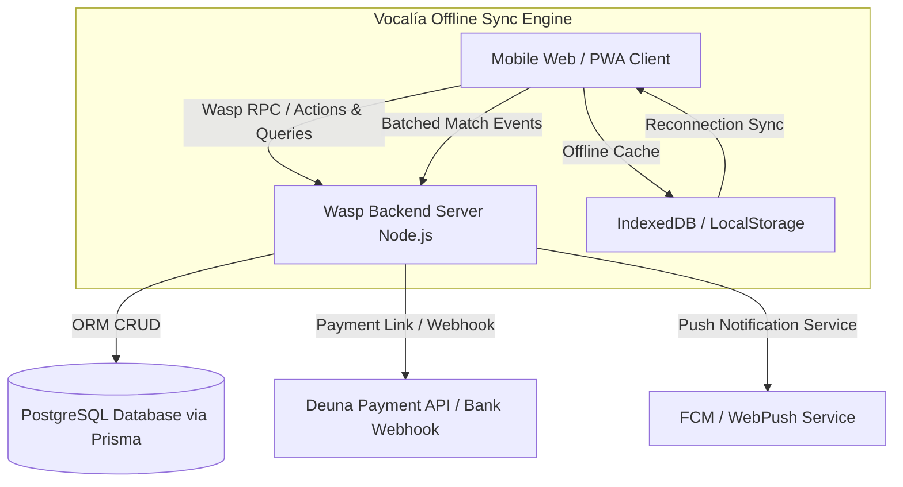

# 🏗️ Technical Architecture & Implementation Plan: Ligas Barriales Platform

> **Plan Version:** 1.0.0  
> **Status:** APPROVED FOR IMPLEMENTATION  
> **Feature Name:** `ligas-barriales-platform`  
> **Target Specification:** [`.specify/specs/ligas-barriales/spec.md`](file:///c:/Users/ADMIN/Downloads/Practicas%202026/social-soccer/.specify/specs/ligas-barriales/spec.md)  
> **Governing Constitution:** [`.specify/constitution.md`](file:///c:/Users/ADMIN/Downloads/Practicas%202026/social-soccer/.specify/constitution.md)  

---

## 📐 System Architecture Diagram



---

## 🛠️ Step-by-Step Implementation Roadmap

### Phase 1: Database Schema Expansion (`schema.prisma`)
Update the database models to support players, teams, matches, live events, payments, and community rewards.

#### Files to Modify / Create:
- [MODIFY] [`social-soccer/template/app/schema.prisma`](file:///c:/Users/ADMIN/Downloads/Practicas%202026/social-soccer/template/app/schema.prisma)

```prisma
// Models to append:
model PlayerProfile {
  id              String         @id @default(uuid())
  userId          String         @unique
  user            User           @relation(fields: [userId], references: [id])
  fullName        String
  dni             String         @unique
  photoUrl        String?
  qrCode          String         @unique
  isSuspended     Boolean        @default(false)
  currentTeamId   String?
  team            Team?          @relation(fields: [currentTeamId], references: [id])
  matchEvents     MatchEvent[]
  communityPoints Int            @default(0)
  createdAt       DateTime       @default(now())
}

model Team {
  id              String         @id @default(uuid())
  name            String
  logoUrl         String?
  category        String
  delegateId      String
  players         PlayerProfile[]
  homeMatches     Match[]        @relation("HomeTeam")
  awayMatches     Match[]        @relation("AwayTeam")
  payments        PaymentRecord[]
}

model Match {
  id              String         @id @default(uuid())
  homeTeamId      String
  awayTeamId      String
  homeTeam        Team           @relation("HomeTeam", fields: [homeTeamId], references: [id])
  awayTeam        Team           @relation("AwayTeam", fields: [awayTeamId], references: [id])
  scheduledAt     DateTime
  pitchName       String
  status          MatchStatus    @default(SCHEDULED)
  homeGoals       Int            @default(0)
  awayGoals       Int            @default(0)
  events          MatchEvent[]
  vocalSignedAt   DateTime?
}

enum MatchStatus {
  SCHEDULED
  LIVE
  FINISHED
  SUSPENDED
}

model MatchEvent {
  id              String         @id @default(uuid())
  matchId         String
  match           Match          @relation(fields: [matchId], references: [id])
  playerId        String
  player          PlayerProfile  @relation(fields: [playerId], references: [id])
  eventType       EventType
  minute          Int
}

enum EventType {
  GOAL
  ASSIST
  YELLOW_CARD
  RED_CARD
  SUB_IN
  SUB_OUT
}

model PaymentRecord {
  id              String         @id @default(uuid())
  teamId          String
  team            Team           @relation(fields: [teamId], references: [id])
  amount          Float
  paymentType     PaymentType
  paymentMethod   PaymentMethod
  referenceNumber String?
  proofUrl        String?
  status          PaymentStatus  @default(PENDING)
  createdAt       DateTime       @default(now())
}

enum PaymentType {
  REFEREE_FEE
  FINE
  INSCRIPTION
}

enum PaymentMethod {
  DEUNA
  BANK_TRANSFER
  CASH
}

enum PaymentStatus {
  PENDING
  VERIFIED
  REJECTED
}
```

---

### Phase 2: Wasp Backend Operations & Logic (`main.wasp.ts` & `src/server/`)

Define Wasp queries and actions to handle Digital ID, Vocalía match logging, and payment processing.

#### 1. Wasp Configuration Definitions
- [MODIFY] [`social-soccer/template/app/main.wasp.ts`](file:///c:/Users/ADMIN/Downloads/Practicas%202026/social-soccer/template/app/main.wasp.ts)

```typescript
// Queries
query getPlayerDigitalCard {
  fn: import { getPlayerDigitalCard } from "@src/player/queries",
  entities: [PlayerProfile, Team]
}

query getLeagueStandings {
  fn: import { getLeagueStandings } from "@src/league/queries",
  entities: [Team, Match]
}

// Actions
action verifyPlayerQr {
  fn: import { verifyPlayerQr } from "@src/vocalia/actions",
  entities: [PlayerProfile]
}

action recordMatchEvent {
  fn: import { recordMatchEvent } from "@src/vocalia/actions",
  entities: [Match, MatchEvent, PlayerProfile]
}

action finalizeMatchSheet {
  fn: import { finalizeMatchSheet } from "@src/vocalia/actions",
  entities: [Match, Team]
}

action initiateDeunaPayment {
  fn: import { initiateDeunaPayment } from "@src/payments/actions",
  entities: [PaymentRecord, Team]
}
```

#### 2. Backend RPC Functions Implementation
- [NEW] `social-soccer/template/app/src/player/queries.ts` (Fetch digital card & QR)
- [NEW] `social-soccer/template/app/src/vocalia/actions.ts` (Process live goals, cards, QR scan verification)
- [NEW] `social-soccer/template/app/src/payments/actions.ts` (Integrate Deuna payment API links & manual proof upload)

---

### Phase 3: Frontend User Experience & UI Components (`src/client/`)

Build mobile-first React components using ShadCN UI and Tailwind CSS.

#### Component Breakdown:

1. **Carnet Digital Player Component (`DigitalIDCard.tsx`)**
   - Displays player photo, full name, DNI, team badge, status badge (Habilitado / Suspendido).
   - Generates high-contrast QR code (`qrcode.react`) with 60-second HMAC token for zero-fraud verification.

2. **Vocalía Digital Live Interface (`LiveVocaliaTable.tsx`)**
   - Tagger UI optimized for touch screens on tablets/phones.
   - Quick-select roster list with instant tap buttons for: `[+ Gol]`, `[+ Tarjeta Amarilla]`, `[+ Tarjeta Roja]`, `[Cambio]`.
   - Offline fallback using `localStorage` sync queue so vocal ref can operate without internet connectivity at the pitch.

3. **Live Standings & Fixture Center (`FixturesAndStandings.tsx`)**
   - Real-time updating table showing Points, Goal Difference, Form (W/D/L).
   - Map link toggle (Google Maps / Waze) for pitch location.

4. **Deuna & Bank Transfer Payment Modal (`DeunaPaymentModal.tsx`)**
   - Direct button to open Deuna app payment flow or scan Deuna merchant QR code.
   - File dropzone for uploading bank transfer receipts with instant notification to League Treasurer.

---

### Phase 4: Offline Synchronization Engine (Vocalía Resiliency)

Implement service worker / LocalStorage queue for vocal referees in areas with low cellular coverage:

```typescript
// Client-side offline queue handler helper
export const syncOfflineMatchEvents = async () => {
  const queuedEvents = JSON.parse(localStorage.getItem('pending_match_events') || '[]');
  if (queuedEvents.length === 0 || !navigator.onLine) return;

  for (const event of queuedEvents) {
    await recordMatchEvent(event);
  }
  localStorage.setItem('pending_match_events', '[]');
};
```

---

## 📋 Task Checklist & Execution Order

- [ ] **Task 1: DB Schema Migration**
  - Append Prisma models to `schema.prisma`.
  - Run `wasp db migrate-dev` to apply changes.
- [ ] **Task 2: Digital ID & QR Verification Engine**
  - Create QR generation query and scanner verification action.
  - Test QR verification under expired token scenarios.
- [ ] **Task 3: Vocalía Tagger Interface**
  - Build touch-friendly React UI for vocal referees.
  - Implement offline queue fallback mechanism.
- [ ] **Task 4: Standings & Automatic Classification Calculation**
  - Implement RPC to auto-aggregate points, goals, and tie-breakers upon match finalization.
- [ ] **Task 5: Deuna Payment Integration**
  - Connect payment action with Deuna API endpoints.
  - Implement bank transfer proof verification flow.
- [ ] **Task 6: E2E Playwright Tests**
  - Write Playwright tests verifying full user journey: Login -> Show Digital ID -> Vocal Records Goal -> Standings Updated.

---

## 🧪 Verification & Acceptance Plan

### Automated Checks
- **Type Checking:** Execute `npm run check` (or Wasp build check) to verify zero TypeScript errors.
- **Lint & Format:** Execute `npm run lint` and `npm run prettier:check`.
- **E2E Test Flow:** Run `npx playwright test` covering digital card display and match sheet finalization.

### Manual Verification Checklist
1. Open Digital ID on mobile browser viewport, verify QR renders cleanly within 2 seconds.
2. Simulate offline mode in Chrome DevTools Network tab, log a goal in Vocalía UI, restore network, verify automatic sync to database.
3. Complete a test payment via Deuna sandbox link and verify payment status transitions to `VERIFIED`.


## Conexiones
- Uso de Fintech para el procesamiento de pagos de inscripciones y tokenización.
- Uso de DataWallet para manejar un perfil único del jugador entre distintas ligas.
- Uso de la Agencia de Marketing AI para promover las ligas y conseguir patrocinadores.
- Conexión con Tickets para la venta de entradas en ligas grandes.
